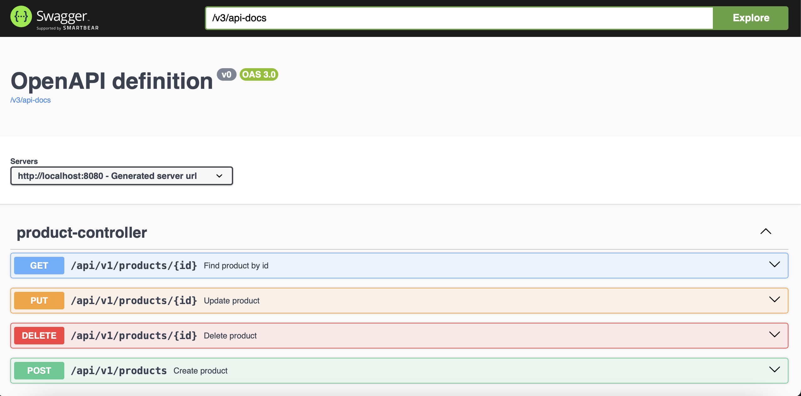
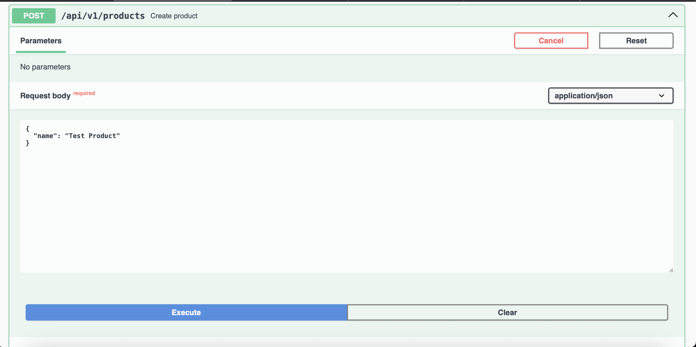
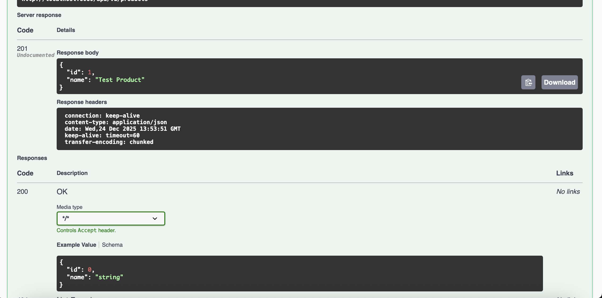
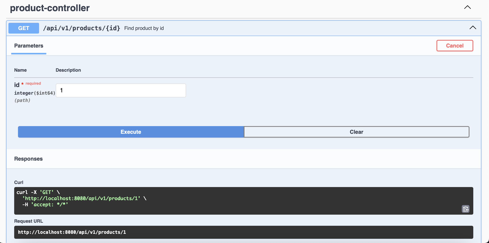
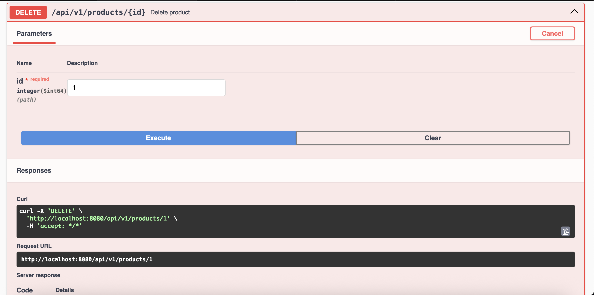
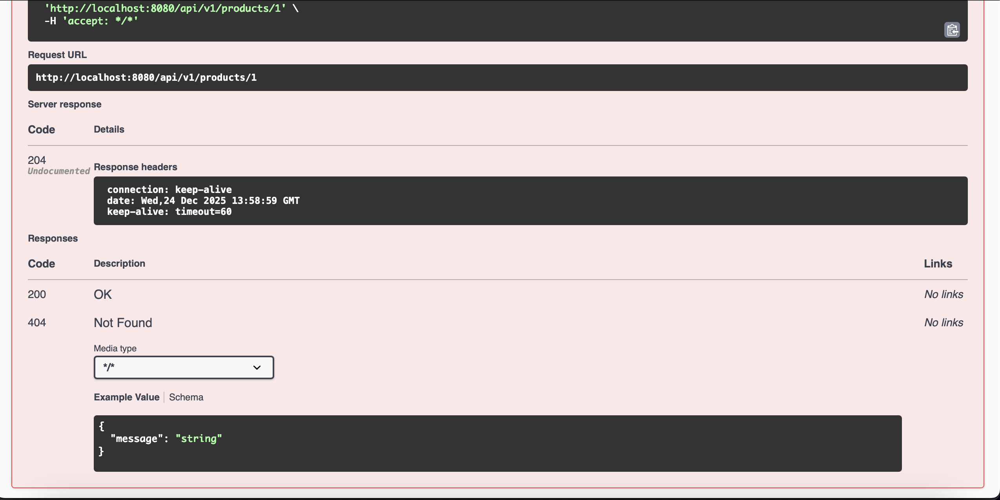
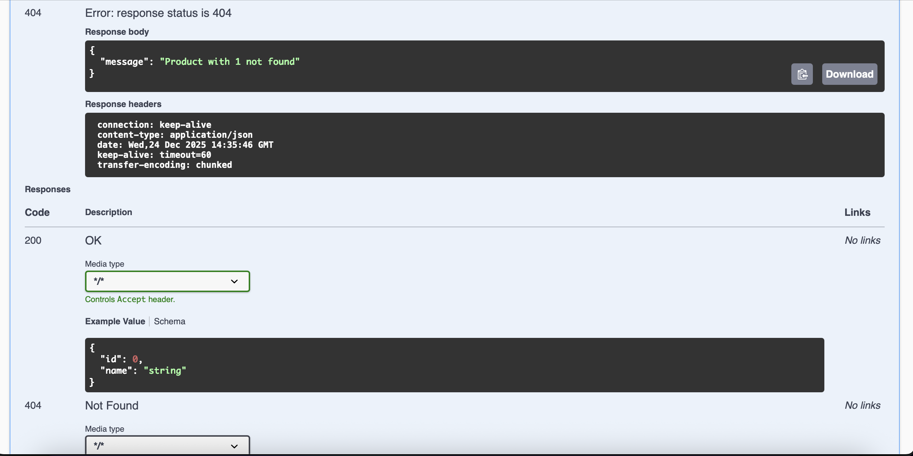

# Product Management REST API - Task 2

This document covers **Task 2 (Final Implementation)**. It builds upon Task 1 by implementing a full Product Management System with **CRUD** (Create, Read, Update, Delete) operations, **Exception Handling**, and an **In-Memory Repository**.

## 🚀 Features
* **Create Product:** Add new products to the system via API.
* **Read Product:** Retrieve detailed product information by ID.
* **Delete Product:** Remove a product from the database.
* **Exception Handling:** Custom **404 Not Found** error when accessing non-existent IDs.
* **In-Memory Storage:** Uses `HashMap` for data persistence as per requirements.
* **API Documentation:** Fully integrated with **Swagger UI**.

## 🛠 Technologies Used
* **Java 17**
* **Spring Boot 3.2.5**
* **Spring Web** (REST API)
* **SpringDoc OpenAPI** (Swagger UI)
* **Maven**

## ⚙️ How to Run
1.  Open the project in **IntelliJ IDEA**.
2.  Run the `FirstRestApiSpringApplication` class.
3.  Once the application starts, open **Swagger UI** to test the API:
    👉 **[http://localhost:8080/swagger-ui/index.html](http://localhost:8080/swagger-ui/index.html)**

---

## 📸 API Usage & Screenshots
Below is the step-by-step verification of all functionalities using Swagger UI.

### 0️⃣ API Overview
The main dashboard showing all available endpoints in the `product-controller`.

### 1️⃣ Create Product (POST)
**Action:** Adding a new product named "Test Product".
* **Request (Input):**
  
* **Response (Output - 200 OK):**
  

### 2️⃣ Read Product (GET)
**Action:** Retrieving details of the product with ID `1`.
* **Request (Input):**
  
* **Response (Output - JSON Body):**
  
* **Response (Output - Headers):**
  

### 3️⃣ Delete Product (DELETE)
**Action:** Removing the product with ID `1`.
* **Request (Input):**
  
* **Response (Output - 204 No Content):**
  

### 4️⃣ Exception Handling (404 Not Found)
**Action:** Trying to access the deleted product (ID `1`).
* **Result:** The system returns a custom error message.
  

---

## 🔌 API Endpoints Reference
| Method | Endpoint | Description |
| :--- | :--- | :--- |
| **POST** | `/api/v1/products` | Create a new product |
| **GET** | `/api/v1/products/{id}` | Get product details |
| **PUT** | `/api/v1/products/{id}` | Update product name |
| **DELETE** | `/api/v1/products/{id}` | Delete a product |

## 👨‍💻 Author
* **Student:** Miray Büyüktepe
* **Task:** #2 - CRUD Operations
